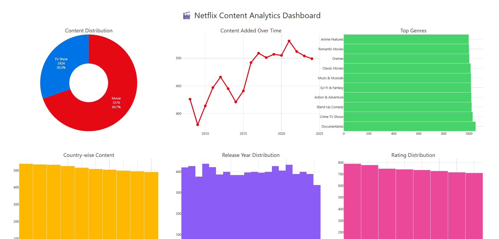
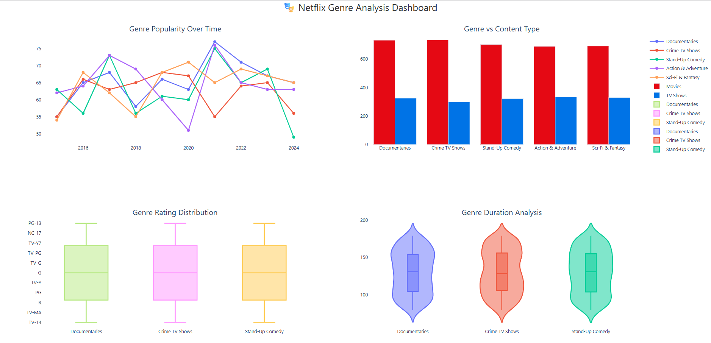
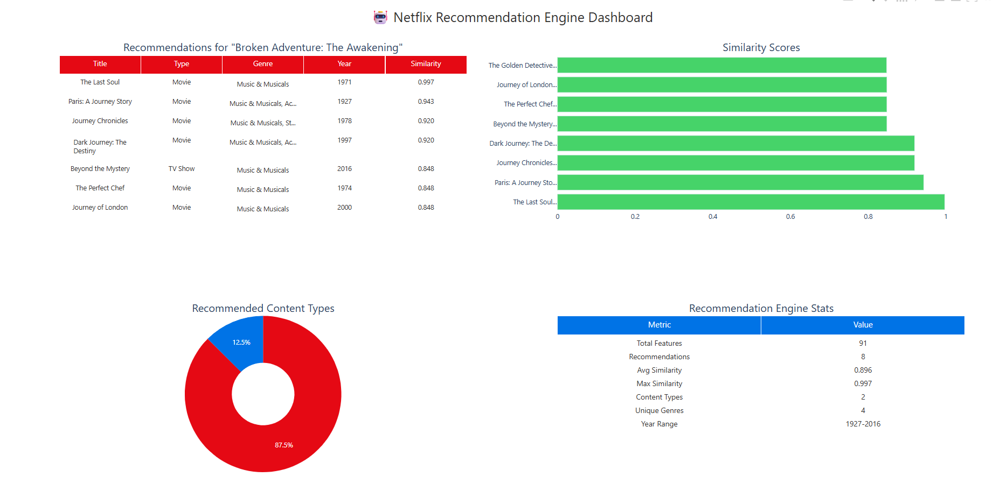
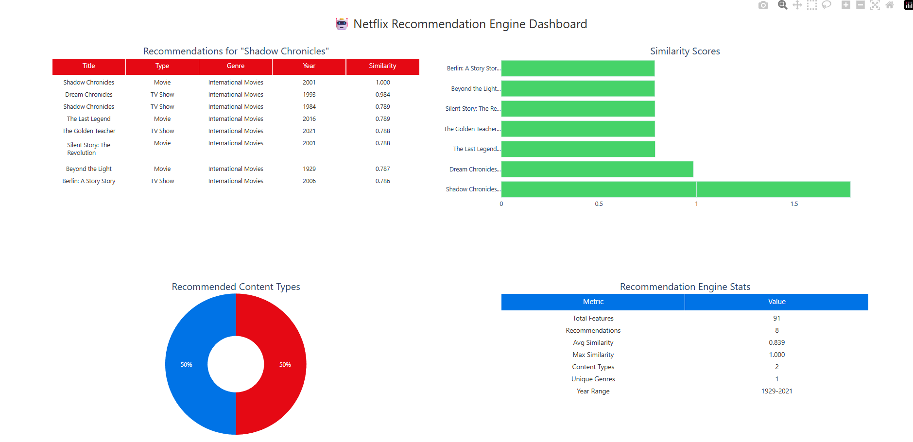
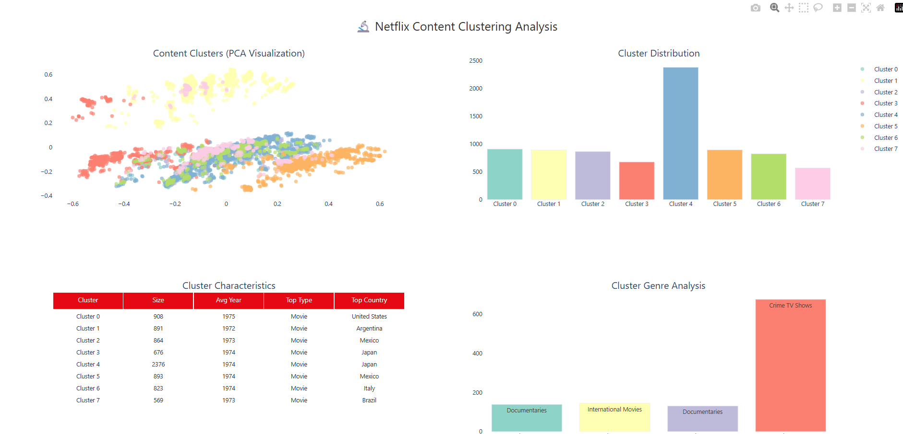

# 🎬 Netflix Content Analysis & Recommendation System

An all-in-one Python application that analyzes Netflix content trends and generates personalized content-based recommendations. The project includes Power BI-style dashboards for executive insights, genre trends, clustering, and a robust TF-IDF-based recommender engine.

---

## ✅ Features

- 📊 **Executive Dashboard** — Overview of Netflix's global content distribution
- 🎭 **Genre Analysis** — Visualize top genres and their popularity over time
- 🤖 **Recommendation Engine** — Content-based suggestions using NLP (TF-IDF + cosine similarity)
- 🔬 **Clustering Analysis** — Segment content with PCA + KMeans and explore hidden patterns
- 📈 **Text Summary Report** — Insightful command-line summary with key metrics
- 🧠 Smart fallback — Auto-generates mock data if real dataset is unavailable

---

## 🧰 Tech Stack

- **Python 3.10+**
- `Pandas`, `Numpy`, `Seaborn`, `Matplotlib`
- `Plotly` (dashboards), `scikit-learn` (ML)
- `TF-IDF`, `PCA`, `KMeans`, `Cosine Similarity`

---

## 📸 Sample Visuals

## 📊 Key Modules

- Executive Overview: Content by type, country, release year, ratings, duration, KPIs
- Genre Insights: Trends over time, content type split, rating/length distributions
- Recommender Engine: Top 10 similar titles with similarity scores
- Clustering: Visual PCA scatter and genre-based cluster characteristics
- Text Summary: Console-based analysis snapshot

